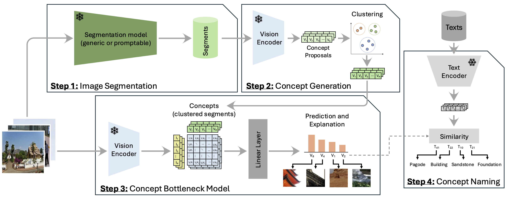

# Aligning Visual and Semantic Interpretability through Visually Grounded Concept Bottleneck Models
You can find our paper on **[arXiv](https://arxiv.org/abs/2412.11576)** 📄.

Authors: Patrick Knab, Katharina Prasse, Sascha Marton, Christian Bartelt, and Margret Keuper 



---

## Overview

This repository is organized into two main components:

1. **Concept Extraction**
2. **GCBM Training and Visualization**

---

### 1. Concept Extraction

#### Step 1: Select Segmentation Models

Choose segmentation models based on your computational budget and the latest advancements. GDINO is the fastest model in our evaluation. We provide `.yml` files for all segmentation methods used in this work.

Build **SAM2**, **GroundingDINO**, and **Semantic SAM** from source, as suggested in their respective GitHub repositories. Place the repositories in the `utilities` folder and adjust the paths as necessary.

#### Step 2: Run the Segmentation Method

Execute the segmentation method by running the respective script in the `Segments` folder:

```bash
python scripts/create_segments_SAM2.py --dataset cifar100 --device cuda:0
```

#### Step 3: Embed Segments

Embed the segments into the selected embedding space by running the corresponding script in the `Segments` folder. We primarily report on CLIP models [RN-50, ViT-B16, ViT-L14] and save embeddings to reuse in GCBM training for efficiency.

```bash
python scripts/emb_segments_CLIP.py --dataset cifar100 --device cuda:0 --emb CLIP-RN50 --seg_method SAM2
```

---

### 2. GCBM Training and Visualization

#### Step 1: Create a Validation Set

For datasets without a provided validation set, create one by splitting the training set. Following common practices, we evaluate on the ImageNet-Val split, so we need a new set for hyperparameter validation.

Split the training set into training and validation sets (90:10). Ensure the test set is named `test`, as some datasets have `train` and `val` sets.

Adjust the dataset path in the script to your existing training set and the new validation set.

```bash
python data/Datasets/scripts/create_val.py
```

#### Step 2: Embed Images

Embed images to reuse in GCBM training for time and resource efficiency.

```bash
python data/Datasets/scripts/embed_CLIP.py
```

#### Step 3: Train GCBM

With all necessary files correctly stored in the `data` directory, initiate GCBM training:

```bash
python gcbm_training/gcbm_testing.py
```

**Necessary Files in `data/`:**

1. `classes/`  
   Contains class information for the dataset (required for new datasets).
2. `Concepts/`  
   Directory to store previously extracted concepts.
3. `Datasets/`  
   Contains the training, testing, and validation datasets.
4. `Embeddings/`  
   - Subset of embeddings (if not segmenting all training images).
   - Embedded files for test, validation, and training sets.
5. `Segments/`  
   - Contains segmented images.
   - Includes embeddings in the `Seg_embs/` subdirectory.

We also provide multiple Jupyter notebooks in `gcbm_training/` to facilitate training and hyperparameter tuning.

#### Using Your Own Datasets

To apply the code to a new dataset, modify the relevant sections in `utils/gcbm.py` as indicated by the `TODO` comments.

#### GCBM Visualization

Explore interactive explanations with GCBM across different datasets using the Jupyter notebooks in `interpretation/`.

---

## Installation

Install the required dependencies using the provided `requirements.txt` file:

```bash
pip install -r requirements.txt
```

This environment supports the creation of CLIP embeddings. We have also created specialized environments for generating DINOv2 embeddings and using various segmentation models.

---

## Folder Structure

The repository is structured as follows:

```bash
.
├── concept_extraction/
├── gcbm_training/
├── data/
│   ├── classes/
│   ├── Concepts/
│   ├── Datasets/
│   ├── Embeddings/
│   ├── Segments/
├── experiments/
├── utils/
├── interpretation/
├── requirements.txt
└── README.md
```


- `concept_extraction/`: Scripts and modules for extracting concepts.
- `gcbm_training/`: Code for training the GCBM model.
- `data/`: Directories for classes, concepts, datasets, embeddings, and segments.
- `experiments/`: Code for experiments detailed in the main paper and supplementary material.
- `utils/`: Helper scripts for running experiments.
- `interpretation/`: Tools for visualizing GCBM explanations.

**Important:** Some folders in the `data/` directory may be empty. Due to size limitations, we couldn't upload the complete dataset and corresponding concepts. Therefore, these folders lack content.

To run the scripts correctly, please add the required datasets before execution.

---

For more details, please refer to the sections and scripts within the repository or consult the paper.
